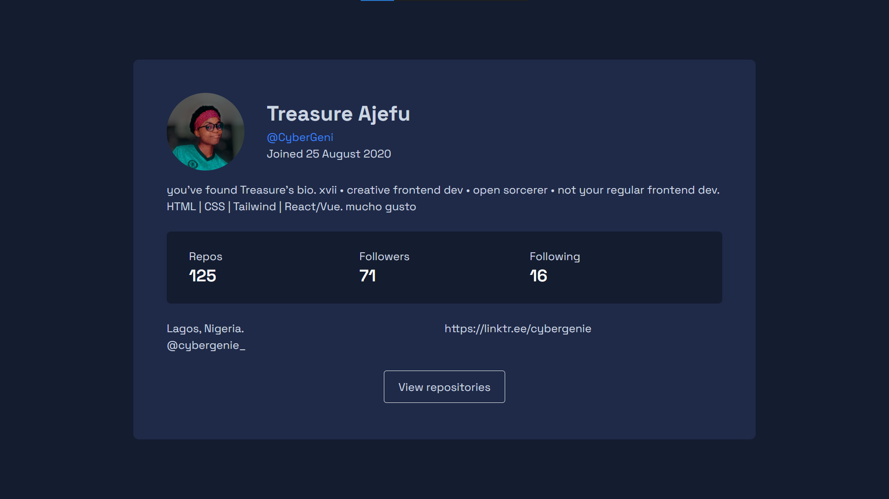

# AltSchool Second Semester Exam

## Overview
Build out a simple web app that consumes the GitHub API to display a list of repositories for a given user. The app should have 2 pages: a page that shows a list of repositories for a given user, and a page that shows the details of a single repository.

Hosted on Netlify: https://github-user-api-with-pagination.netlify.app/